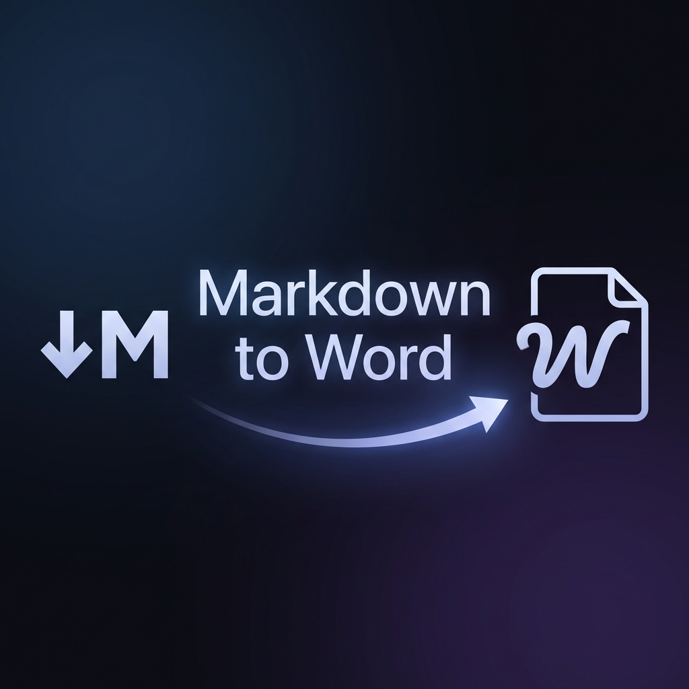
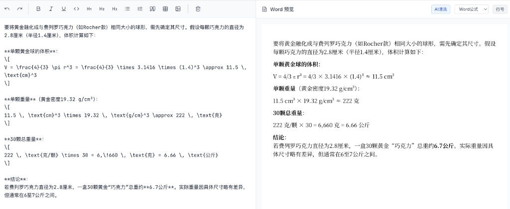

<p align="center">
  
</p>

# ✨ Markdown to Word (MD2Word)

<p align="center">
  
  
  
  
</p>

<p align="center">
  <strong>🚀 可能是目前最优雅的纯前端 Markdown 转 Word 生产力工具</strong>
</p>

---

## 📖 简介

**Markdown to Word** 是一款专为 AI 时代打造的格式转换神器。无论你是 ChatGPT、Claude 还是 DeepSeek 的深度用户，它都能帮你一键将充满代码块和数学公式的对话内容，完美转化为排版精美的 Word 文档。

> [!TIP]
> **100% 隐私安全**：所有转换操作均在浏览器本地完成，数据永不上传服务器。

---

## ✨ 核心特性

- **🤖 AI 内容清洗 (New!)**：自动识别并剔除 AI 对话中的“复制按钮”、“引用标记”等无关文字。
- **📈 极致数学公式 (New!)**：支持 LaTeX 自动纠错与排版，数学模型、科学算式完美导出。
- **🎨 丰富元素支持**：
  - **表格转换**：支持基本表格及复杂的合并单元格（上下左右自动识别）。
  - **代码高亮**：保留语法高亮，可选行号，文档阅读更专业。
  - **Mermaid 图表**：直接将流程图、时序图导出为高清图片。
- **⚡️ 实时预览**：左侧编辑，右侧同步展示 Word 样式的标准视图。
- **📋 双模输出**：一键“复制富文本”粘贴至飞书/Notion，或直接下载 `.docx` 标准文档。

---

## 📸 演示效果



---

## 🛠️ 兼容性矩阵

| 功能模块 | Word (Win/Mac) | WPS Office | 飞书/Notion | 移动端预览 |
| :--- | :---: | :---: | :---: | :---: |
| **基础文本/标题** | ✅ 完美 | ✅ 完美 | ✅ 完美 | ✅ 兼容 |
| **表格 (含合并)** | ✅ 完美 | ✅ 完美 | ✅ 兼容 | ⚠️ 布局受限 |
| **数学公式 (LaTeX)** | ✅ 完美 | ✅ 完美 | ✅ 完美 | ✅ 兼容 |
| **代码块** | ✅ 完美 | ✅ 完美 | ✅ 完美 | ✅ 兼容 |

---

## 🚀 快速开始

### 方式一：Chrome 扩展程序 (推荐)

最便捷的方式，随手可用：

1. 下载 [最新发布的扩展包 (ZIP)](https://github.com/37du3/markdown-to-word/releases)
2. 解压 ZIP 文件
3. 打开 Chrome 扩展管理页 `chrome://extensions/`
4. 开启右上角"开发者模式"
5. 从左上角点击"加载已解压的扩展程序"，选择解压后的文件夹

**使用方法：**
1. 复制 AI 生成的内容
2. 点击扩展图标，选择"从剪贴板导入"
3. 转换后直接粘贴到 Word

### 方式二：在线 Web 版

无需安装，打开即用：
[https://37du3.github.io/markdown-to-word/](https://37du3.github.io/markdown-to-word/)

### 方式三：本地部署

```bash
# 1. 克隆
git clone https://github.com/37du3/markdown-to-word.git

# 2. 安装
npm install

# 3. 运行 Web 版
npm run dev

# 4. 构建扩展
npm run build:ext
```

---

## 🏗️ 技术栈

- **Core**: React 18 + TypeScript + Vite
- **Markdown**: `marked` + `marked-katex-extension`
- **Docx Engine**: `docx.js`
- **Styling**: Vanilla CSS + Tailwind CSS (Components)
- **Icons**: Lucide React

---

## 🤝 贡献与交流

欢迎提交 [Issue](https://github.com/37du3/markdown-to-word/issues) 或 Pull Request 来完善这个项目。

**License**: MIT
**Author**: [37du3](https://github.com/37du3)
